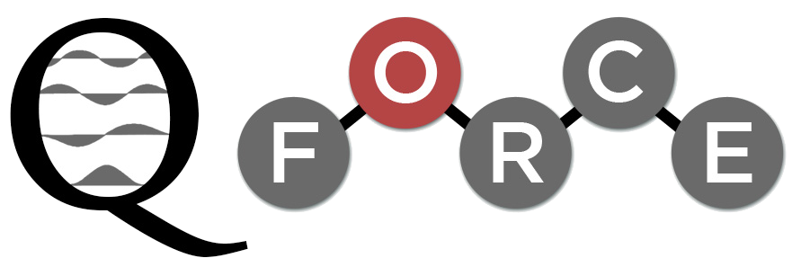

  **Quantum Mechanically Augmented Molecular Force Fields**

*Q-Force is a software package for deriving all-atom force fields from quantum mechanical calculations in an automated manner.*

If you use Q-Force, please cite:

`Sami, S.; Menger, M. F. S. J.; Faraji, S.; Broer, R.; Havenith, R. W. A., Q-Force: Quantum Mechanically Augmented Molecular Force Fields. Journal of Chemical Theory and Computation 2021, 17 (8), 4946-4960.
<https://pubs.acs.org/doi/10.1021/acs.jctc.1c00195>`_

=============
Documentation
=============

.. toctree::
   :maxdepth: 2

   install.rst
   method.rst
   usage.rst
   examples.rst
   options.rst

